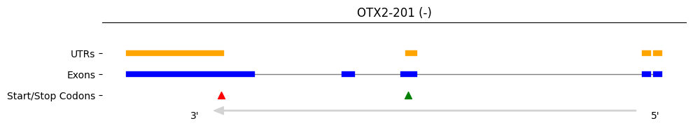

# gene_model_plot

gene_model_plot is a Python package designed to visualize gene models from GTF files and variants from VCF files. The package allows for easy extraction and plotting of gene features such as exons, UTRs, start/stop codons, and variants. Utilizes `matplotlib`, `pysam`, and `gffutils`.

## Features

- Create or load a gene feature database from GTF files.
- Extract and plot gene features including exons, UTRs, start codons, and stop codons.
- Extract and plot variants from VCF files.
- Support for visualizing multiple VCF files.
- Generate plots as images or base64-encoded strings.

## Installation

To install gene_model_plot, pip install it from this repo:

```bash
pip install git+https://github.com/rnabioco/gene_model_plot.git
```

## Usage

Here is an example of how to use GeneModelPlot to visualize a gene model:

```python
from gene_model_plot.gene_model import GeneModel

# initialize the GeneModel object with the GTF file 
# to create the gene model object
gmo = GeneModel("gencode.v43.annotation.gtf")

# plot the gene model
gmo.plot("ENST00000339475.10")
```



```python
# Alternatively, save the plot as a PNG file
gene_model.plot(gene_id, return_png=True)

# Or get the plot as a base64-encoded string
base64_image = gene_model.plot(gene_id, return_base64=True)

# load vcf tracks with a vcf file or a directory of vcf_files
gmo = GeneModel("gencode.v43.annotation.gtf", "/vcfs/modifications.vcf")
```

## Contributing

Contributions are welcome! Please open an issue or submit a pull request for any changes.